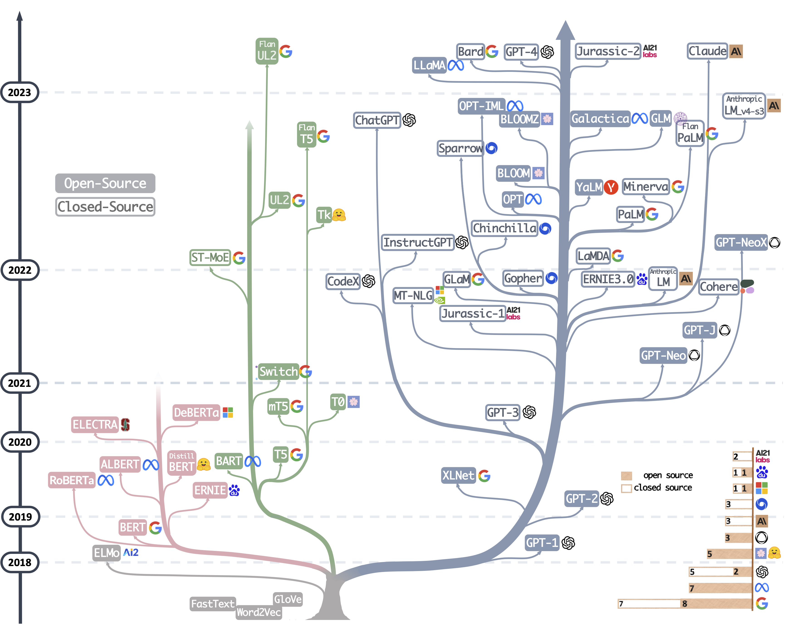

<h1 align="center">The Practical Guides for Large Language Models</h1>

		     

A curated (still actively updated) list of practical guide resources of LLMs. These sources aim to help practitioners navigate the vast landscape of large language models (LLMs) and their applications in natural language processing (NLP) applications. 

## Practical Guide for Models

We build an evolutionary tree of modern Large Language Models (LLMs) to trace the development of language models in recent years and highlights some of the most well-known models, in the following figure:

### BERT-style Language Models: Encoder-Decoder or Encoder-only

- BERT **BERT: Pre-training of Deep Bidirectional Transformers for Language Understanding**, 2018, [Paper](https://aclanthology.org/N19-1423.pdf)
- RoBERTa **ALBERT: A Lite BERT for Self-supervised Learning of Language Representations**, 2019, [Paper](https://arxiv.org/abs/1909.11942)
- DistilBERT **DistilBERT, a distilled version of BERT: smaller, faster, cheaper and lighter**, 2019, [Paper](https://arxiv.org/abs/1910.01108)
- ALBERT **ALBERT: A Lite BERT for Self-supervised Learning of Language Representations**, 2019, [Paper](https://arxiv.org/abs/1909.11942)
- ELECTRA **ELECTRA: PRE-TRAINING TEXT ENCODERS AS DISCRIMINATORS RATHER THAN GENERATORS**, 2020, [Paper](https://openreview.net/pdf?id=r1xMH1BtvB)
- T5 **"Exploring the Limits of Transfer Learning with a Unified Text-to-Text Transformer"**. *Colin Raffel et al.* JMLR 2019. [[Paper](https://arxiv.org/abs/1910.10683)]
- AlexaTM **"AlexaTM 20B: Few-Shot Learning Using a Large-Scale Multilingual Seq2Seq Model"**. *Saleh Soltan et al.* arXiv 2022. [[Paper](https://arxiv.org/abs/2208.01448)]

### GPT-style Language Models: Decoder-only

- GPT-3 **"Language Models are Few-Shot Learners"**. NeurIPS 2020. [[Paper](https://arxiv.org/abs/2005.14165)]
- OPT **"OPT: Open Pre-trained Transformer Language Models"**. 2022. [[Paper](https://arxiv.org/abs/2205.01068)] 
- PaLM **"PaLM: Scaling Language Modeling with Pathways"**. *Aakanksha Chowdhery et al.* arXiv 2022. [[Paper](https://arxiv.org/abs/2204.02311)]
- BLOOM  **"BLOOM: A 176B-Parameter Open-Access Multilingual Language Model"**. 2022. [[Paper](https://arxiv.org/abs/2211.05100)]
- GLM **"GLM-130B: An Open Bilingual Pre-trained Model"**. 2022. [[Paper](https://arxiv.org/abs/2210.02414)] 
- MT-NLG **"Using DeepSpeed and Megatron to Train Megatron-Turing NLG 530B, A Large-Scale Generative Language Model"**. 2021. [[Paper](https://arxiv.org/abs/2201.11990)]
- GLaM **"GLaM: Efficient Scaling of Language Models with Mixture-of-Experts"**. ICML 2022. [[Paper](https://arxiv.org/abs/2112.06905)]
- Gopher **"Scaling Language Models: Methods, Analysis & Insights from Training Gopher"**. 2021. [[Paper](http://arxiv.org/abs/2112.11446v2)]
- chinchilla **"Training Compute-Optimal Large Language Models"**. 2022. [[Paper](https://arxiv.org/abs/2203.15556)]
- LaMDA **"LaMDA: Language Models for Dialog Applications"**. 2021. [[Paper](https://arxiv.org/abs/2201.08239)]
- LLaMA **"LLaMA: Open and Efficient Foundation Language Models"**. 2023. [[Paper](https://arxiv.org/abs/2302.13971v1)]
- GPT-4 **"GPT-4 Technical Report"**. 2023. [[Paper](http://arxiv.org/abs/2303.08774v2)]
- BloombergGPT **BloombergGPT: A Large Language Model for Finance**, 2023, [Paper](https://arxiv.org/abs/2303.17564)
- GPT-NeoX-20B: **"GPT-NeoX-20B: An Open-Source Autoregressive Language Model"**. 2022. [[Paper](https://arxiv.org/abs/2204.06745)] 

## Practical Guide for Data

### Pretraining data
-**How does the pre-training objective affect what large language models learn about linguistic properties?**, ACL 2022. [Paper](https://aclanthology.org/2022.acl-short.16/)
### Finetuning data
### Test data/user data

## Practical Guide for NLP Tasks
We build a decision flow for choosing LLMs or fine-tuned models~\protect\footnotemark for user's NLP applications. The decision flow helps users assess whether their downstream NLP applications at hand meet specific conditions and, based on that evaluation, determine whether LLMs or fine-tuned models are the most suitable choice for their applications.

  

### Traditional NLU tasks
1. No use case
2. Use case

### Traditional NLG tasks
1. Use case
2. No use case

### Knowledge-intensive tasks
1. Use case
2. No use case

### Abilities with Scaling

Scaling of LLMs~(e.g. parameters, training computation, etc.) can greatly empower pretrained language models. With the model scaling up, a model generally becomes more capable in a range of tasks. Reflected in some metrics, the performance shows a power-law relationship with the model scale.

1. Use Case with Reasoning
    - Arithmetic reasoning
    - Problem solving
    - Commonsense reasoning
2. Use Cases with Emergent Abilities
    - Word manipulation
    - Logical deduction
    - Logical sequence
    - Logic grid puzzles
    - Simple math problems
    - Coding abilities
    - Concept understanding
3. No-Use Cases
    - Redefine-math
    - Into-the-unknown
    - Memo-trap
    - NegationQA

### Specific tasks
1. No use case
2. Use case

### Real-World Tasks

### Efficiency
1. Cost
2. Latency
3. Parameter-Efficient Fine-Tuning

### Trustworthiness
1. Robustness and Calibration
2. Fairness and Bias
3. Spurious biases
