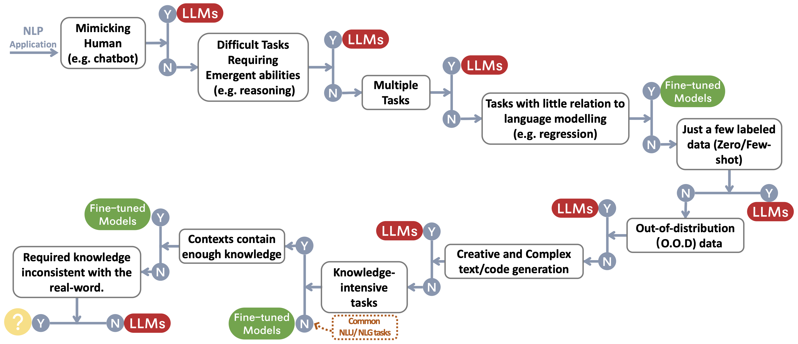

<h1 align="center">The Practical Guides for Large Language Models </h1>


<p align="center">
		     
</p>

A curated (still actively updated) list of practical guide resources of LLMs. It's based on our survey paper: [Harnessing the Power of LLMs in Practice: A Survey on ChatGPT and Beyond](https://arxiv.org/abs/2304.13712) and efforts from @[xinyadu](https://github.com/xinyadu). The survey is partially based on the second half of this [Blog](https://jingfengyang.github.io/gpt). We also build an evolutionary tree of modern Large Language Models (LLMs) to trace the development of language models in recent years and highlights some of the most well-known models. 

These sources aim to help practitioners navigate the vast landscape of large language models (LLMs) and their applications in natural language processing (NLP) applications. We also include their usage restrictions based on the model and data licensing information.
If you find any resources in our repository helpful, please feel free to use them (don't forget to cite our paper! 😃). We welcome pull requests to refine this figure! 

<p align="center">

</p>


```bibtex
    @article{yang2023harnessing,
        title={Harnessing the Power of LLMs in Practice: A Survey on ChatGPT and Beyond}, 
        author={Jingfeng Yang and Hongye Jin and Ruixiang Tang and Xiaotian Han and Qizhang Feng and Haoming Jiang and Bing Yin and Xia Hu},
        year={2023},
        eprint={2304.13712},
        archivePrefix={arXiv},
        primaryClass={cs.CL}
    }
```

## Latest News💥
- We added usage and restrictions section.
- We used PowerPoint to plot the figure and released the source file [pptx](./source/figure_gif.pptx) for our GIF figure. [4/27/2023]
- We released the source file for the still version [pptx](./source/figure_still.pptx), and replaced the figure in this repo with the still version. [4/29/2023]
- Add AlexaTM, UniLM, UniLMv2 to the figure, and correct the logo for Tk. [4/29/2023]
- Add usage and Restrictions (for commercial and research purposes) section. Credits to [Dr. Du](https://github.com/xinyadu).  [5/8/2023]


## Other Practical Guides for LLMs

- **Why did all of the public reproduction of GPT-3 fail? In which tasks should we use GPT-3.5/ChatGPT?** 2023, [Blog](https://jingfengyang.github.io/gpt) 
- **Building LLM applications for production**, 2023, [Blog](https://huyenchip.com/2023/04/11/llm-engineering.html)
- **Data-centric Artificial Intelligence**, 2023, [Repo](https://github.com/daochenzha/data-centric-AI)/[Blog](https://towardsdatascience.com/what-are-the-data-centric-ai-concepts-behind-gpt-models-a590071bb727)/[Paper](https://arxiv.org/abs/2303.10158)


## Catalog
* [The Practical Guides for Large Language Models ](#the-practical-guides-for-large-language-models-)
   * [Practical Guide for Models](#practical-guide-for-models)
      * [BERT-style Language Models: Encoder-Decoder or Encoder-only](#bert-style-language-models-encoder-decoder-or-encoder-only)
      * [GPT-style Language Models: Decoder-only](#gpt-style-language-models-decoder-only)
   * [Practical Guide for Data](#practical-guide-for-data)
      * [Pretraining data](#pretraining-data)
      * [Finetuning data](#finetuning-data)
      * [Test data/user data](#test-datauser-data)
   * [Practical Guide for NLP Tasks](#practical-guide-for-nlp-tasks)
      * [Traditional NLU tasks](#traditional-nlu-tasks)
      * [Generation tasks](#generation-tasks)
      * [Knowledge-intensive tasks](#knowledge-intensive-tasks)
      * [Abilities with Scaling](#abilities-with-scaling)
      * [Specific tasks](#specific-tasks)
      * [Real-World ''Tasks''](#real-world-tasks)
      * [Efficiency](#efficiency)
      * [Trustworthiness](#trustworthiness)
      * [Benchmark Instruction Tuning](#benchmark-instruction-tuning)
      * [Alignment](#alignment)
         * [Safety Alignment (Harmless)](#safety-alignment-harmless)
         * [Truthfulness Alignment (Honest)](#truthfulness-alignment-honest)
         * [Practical Guides for Prompting (Helpful)](#practical-guides-for-prompting-helpful)
         * [Alignment Efforts of Open-source Communtity](#alignment-efforts-of-open-source-communtity)
   * [Usage and Restractions (Models and Data)](#Usage-and-Restrictions)

## Practical Guide for Models

### BERT-style Language Models: Encoder-Decoder or Encoder-only

- BERT **BERT: Pre-training of Deep Bidirectional Transformers for Language Understanding**, 2018, [Paper](https://aclanthology.org/N19-1423.pdf)
- RoBERTa **RoBERTa: A Robustly Optimized BERT Pretraining Approach**, 2019, [Paper](https://arxiv.org/abs/1907.11692)
- DistilBERT **DistilBERT, a distilled version of BERT: smaller, faster, cheaper and lighter**, 2019, [Paper](https://arxiv.org/abs/1910.01108)
- ALBERT **ALBERT: A Lite BERT for Self-supervised Learning of Language Representations**, 2019, [Paper](https://arxiv.org/abs/1909.11942)
- UniLM **Unified Language Model Pre-training for Natural Language Understanding and Generation**, 2019 [Paper](https://arxiv.org/abs/1905.03197)
- ELECTRA **ELECTRA: PRE-TRAINING TEXT ENCODERS AS DISCRIMINATORS RATHER THAN GENERATORS**, 2020, [Paper](https://openreview.net/pdf?id=r1xMH1BtvB)
- T5 **"Exploring the Limits of Transfer Learning with a Unified Text-to-Text Transformer"**. *Colin Raffel et al.* JMLR 2019. [Paper](https://arxiv.org/abs/1910.10683)
- GLM **"GLM-130B: An Open Bilingual Pre-trained Model"**. 2022. [Paper](https://arxiv.org/abs/2210.02414)
- AlexaTM **"AlexaTM 20B: Few-Shot Learning Using a Large-Scale Multilingual Seq2Seq Model"**. *Saleh Soltan et al.* arXiv 2022. [Paper](https://arxiv.org/abs/2208.01448)
- ST-MoE **ST-MoE: Designing Stable and Transferable Sparse Expert Models**. 2022 [Paper](https://arxiv.org/abs/2202.08906)


### GPT-style Language Models: Decoder-only

- GPT **Improving Language Understanding by Generative Pre-Training**. 2018. [Paper](https://s3-us-west-2.amazonaws.com/openai-assets/research-covers/language-unsupervised/language_understanding_paper.pdf)
- GPT-2 **Language Models are Unsupervised Multitask Learners**. 2018. [Paper](https://d4mucfpksywv.cloudfront.net/better-language-models/language_models_are_unsupervised_multitask_learners.pdf)
- GPT-3 **"Language Models are Few-Shot Learners"**. NeurIPS 2020. [Paper](https://arxiv.org/abs/2005.14165)
- OPT **"OPT: Open Pre-trained Transformer Language Models"**. 2022. [Paper](https://arxiv.org/abs/2205.01068)
- PaLM **"PaLM: Scaling Language Modeling with Pathways"**. *Aakanksha Chowdhery et al.* arXiv 2022. [Paper](https://arxiv.org/abs/2204.02311)
- BLOOM  **"BLOOM: A 176B-Parameter Open-Access Multilingual Language Model"**. 2022. [Paper](https://arxiv.org/abs/2211.05100)
- MT-NLG **"Using DeepSpeed and Megatron to Train Megatron-Turing NLG 530B, A Large-Scale Generative Language Model"**. 2021. [Paper](https://arxiv.org/abs/2201.11990)
- GLaM **"GLaM: Efficient Scaling of Language Models with Mixture-of-Experts"**. ICML 2022. [Paper](https://arxiv.org/abs/2112.06905)
- Gopher **"Scaling Language Models: Methods, Analysis & Insights from Training Gopher"**. 2021. [Paper](http://arxiv.org/abs/2112.11446v2)
- chinchilla **"Training Compute-Optimal Large Language Models"**. 2022. [Paper](https://arxiv.org/abs/2203.15556)
- LaMDA **"LaMDA: Language Models for Dialog Applications"**. 2021. [Paper](https://arxiv.org/abs/2201.08239)
- LLaMA **"LLaMA: Open and Efficient Foundation Language Models"**. 2023. [Paper](https://arxiv.org/abs/2302.13971v1)
- GPT-4 **"GPT-4 Technical Report"**. 2023. [Paper](http://arxiv.org/abs/2303.08774v2)
- BloombergGPT **BloombergGPT: A Large Language Model for Finance**, 2023, [Paper](https://arxiv.org/abs/2303.17564)
- GPT-NeoX-20B: **"GPT-NeoX-20B: An Open-Source Autoregressive Language Model"**. 2022. [Paper](https://arxiv.org/abs/2204.06745)
- PaLM 2: **"PaLM 2 Technical Report"**. 2023. [Tech.Report](https://arxiv.org/abs/2305.10403)
- LLaMA 2: **"Llama 2: Open foundation and fine-tuned chat models"**. 2023. [Paper](https://arxiv.org/pdf/2307.09288)
- Claude 2: **"Model Card and Evaluations for Claude Models"**. 2023. [Model Card](https://www-files.anthropic.com/production/images/Model-Card-Claude-2.pdf)


## Practical Guide for Data


### Pretraining data
- **RedPajama**, 2023. [Repo](https://github.com/togethercomputer/RedPajama-Data)
- **The Pile: An 800GB Dataset of Diverse Text for Language Modeling**, Arxiv 2020. [Paper](https://arxiv.org/abs/2101.00027)
- **How does the pre-training objective affect what large language models learn about linguistic properties?**, ACL 2022. [Paper](https://aclanthology.org/2022.acl-short.16/)
- **Scaling laws for neural language models**, 2020. [Paper](https://arxiv.org/abs/2001.08361)
- **Data-centric artificial intelligence: A survey**, 2023. [Paper](https://arxiv.org/abs/2303.10158)
- **How does GPT Obtain its Ability? Tracing Emergent Abilities of Language Models to their Sources**, 2022. [Blog](https://yaofu.notion.site/How-does-GPT-Obtain-its-Ability-Tracing-Emergent-Abilities-of-Language-Models-to-their-Sources-b9a57ac0fcf74f30a1ab9e3e36fa1dc1)
### Finetuning data
- **Benchmarking zero-shot text classification: Datasets, evaluation and entailment approach**, EMNLP 2019. [Paper](https://arxiv.org/abs/1909.00161)
- **Language Models are Few-Shot Learners**, NIPS 2020. [Paper](https://proceedings.neurips.cc/paper/2020/hash/1457c0d6bfcb4967418bfb8ac142f64a-Abstract.html)
- **Does Synthetic Data Generation of LLMs Help Clinical Text Mining?** Arxiv 2023 [Paper](https://arxiv.org/abs/2303.04360)
### Test data/user data
- **Shortcut learning of large language models in natural language understanding: A survey**, Arxiv 2023. [Paper](https://arxiv.org/abs/2208.11857)
- **On the Robustness of ChatGPT: An Adversarial and Out-of-distribution Perspective** Arxiv, 2023. [Paper](https://arxiv.org/abs/2302.12095)
- **SuperGLUE: A Stickier Benchmark for General-Purpose Language Understanding Systems** Arxiv 2019. [Paper](https://arxiv.org/abs/1905.00537)


## Practical Guide for NLP Tasks
We build a decision flow for choosing LLMs or fine-tuned models~\protect\footnotemark for user's NLP applications. The decision flow helps users assess whether their downstream NLP applications at hand meet specific conditions and, based on that evaluation, determine whether LLMs or fine-tuned models are the most suitable choice for their applications.
<p align="center">
  
</p>

### Traditional NLU tasks

- **A benchmark for toxic comment classification on civil comments dataset** Arxiv 2023 [Paper](https://arxiv.org/abs/2301.11125)
- **Is chatgpt a general-purpose natural language processing task solver?** Arxiv 2023[Paper](https://arxiv.org/abs/2302.06476)
- **Benchmarking large language models for news summarization** Arxiv 2022 [Paper](https://arxiv.org/abs/2301.13848)
### Generation tasks
- **News summarization and evaluation in the era of gpt-3** Arxiv 2022 [Paper](https://arxiv.org/abs/2209.12356)
- **Is chatgpt a good translator? yes with gpt-4 as the engine** Arxiv 2023 [Paper](https://arxiv.org/abs/2301.08745)
- **Multilingual machine translation systems from Microsoft for WMT21 shared task**, WMT2021 [Paper](https://aclanthology.org/2021.wmt-1.54/)
- **Can ChatGPT understand too? a comparative study on chatgpt and fine-tuned bert**, Arxiv 2023, [Paper](https://arxiv.org/pdf/2302.10198.pdf)


### Knowledge-intensive tasks
- **Measuring massive multitask language understanding**, ICLR 2021 [Paper](https://arxiv.org/abs/2009.03300)
- **Beyond the imitation game: Quantifying and extrapolating the capabilities of language models**, Arxiv 2022 [Paper](https://arxiv.org/abs/2206.04615)
- **Inverse scaling prize**, 2022 [Link](https://github.com/inverse-scaling/prize)
- **Atlas: Few-shot Learning with Retrieval Augmented Language Models**, Arxiv 2022 [Paper](https://arxiv.org/abs/2208.03299)
- **Large Language Models Encode Clinical Knowledge**, Arxiv 2022 [Paper](https://arxiv.org/abs/2212.13138)


### Abilities with Scaling

- **Training Compute-Optimal Large Language Models**, NeurIPS 2022 [Paper](https://openreview.net/pdf?id=iBBcRUlOAPR)
- **Scaling Laws for Neural Language Models**, Arxiv 2020 [Paper](https://arxiv.org/abs/2001.08361)
- **Solving math word problems with process- and outcome-based feedback**, Arxiv 2022 [Paper](https://arxiv.org/abs/2211.14275)
- **Chain of thought prompting elicits reasoning in large language models**, NeurIPS 2022 [Paper](https://arxiv.org/abs/2201.11903)
- **Emergent abilities of large language models**, TMLR 2022 [Paper](https://arxiv.org/abs/2206.07682)
- **Inverse scaling can become U-shaped**, Arxiv 2022 [Paper](https://arxiv.org/abs/2211.02011)
- **Towards Reasoning in Large Language Models: A Survey**, Arxiv 2022 [Paper](https://arxiv.org/abs/2212.10403)


### Specific tasks
- **Image as a Foreign Language: BEiT Pretraining for All Vision and Vision-Language Tasks**, Arixv 2022 [Paper](https://arxiv.org/abs/2208.10442)
- **PaLI: A Jointly-Scaled Multilingual Language-Image Model**, Arxiv 2022 [Paper](https://arxiv.org/abs/2209.06794)
- **AugGPT: Leveraging ChatGPT for Text Data Augmentation**, Arxiv 2023 [Paper](https://arxiv.org/abs/2302.13007)
- **Is gpt-3 a good data annotator?**, Arxiv 2022 [Paper](https://arxiv.org/abs/2212.10450)
- **Want To Reduce Labeling Cost? GPT-3 Can Help**, EMNLP findings 2021 [Paper](https://aclanthology.org/2021.findings-emnlp.354/)
- **GPT3Mix: Leveraging Large-scale Language Models for Text Augmentation**, EMNLP findings 2021 [Paper](https://aclanthology.org/2021.findings-emnlp.192/)
- **LLM for Patient-Trial Matching: Privacy-Aware Data Augmentation Towards Better Performance and Generalizability**, Arxiv 2023 [Paper](https://arxiv.org/abs/2303.16756)
- **ChatGPT Outperforms Crowd-Workers for Text-Annotation Tasks**, Arxiv 2023 [Paper](https://arxiv.org/abs/2303.15056)
- **G-Eval: NLG Evaluation using GPT-4 with Better Human Alignment**, Arxiv 2023 [Paper](https://arxiv.org/abs/2303.16634)
- **GPTScore: Evaluate as You Desire**, Arxiv 2023 [Paper](https://arxiv.org/abs/2302.04166)
- **Large Language Models Are State-of-the-Art Evaluators of Translation Quality**, Arxiv 2023 [Paper](https://arxiv.org/abs/2302.14520)
- **Is ChatGPT a Good NLG Evaluator? A Preliminary Study**, Arxiv 2023 [Paper](https://arxiv.org/abs/2303.04048)
- **A Comprehensive Study of Knowledge Editing for Large Language Models**, Arxiv 2024 [Paper](https://arxiv.org/abs/2401.01286)

### Real-World ''Tasks''
- **Sparks of Artificial General Intelligence: Early experiments with GPT-4**, Arxiv 2023 [Paper](https://arxiv.org/abs/2303.12712)

### Efficiency
1. Cost
- **Openai’s gpt-3 language model: A technical overview**, 2020. [Blog Post](https://lambdalabs.com/blog/demystifying-gpt-3)
- **Measuring the carbon intensity of ai in cloud instances**, FaccT 2022. [Paper](https://dl.acm.org/doi/abs/10.1145/3531146.3533234)
- **In AI, is bigger always better?**, Nature Article 2023. [Article](https://www.nature.com/articles/d41586-023-00641-w)
- **Language Models are Few-Shot Learners**, NeurIPS 2020. [Paper](https://proceedings.neurips.cc/paper_files/paper/2020/file/1457c0d6bfcb4967418bfb8ac142f64a-Paper.pdf)
- **Pricing**, OpenAI. [Blog Post](https://openai.com/pricing)
2. Latency
- HELM: **Holistic evaluation of language models**, Arxiv 2022. [Paper](https://arxiv.org/abs/2211.09110)
3. Parameter-Efficient Fine-Tuning
- **LoRA: Low-Rank Adaptation of Large Language Models**, Arxiv 2021. [Paper](https://arxiv.org/abs/2106.09685)
- **Prefix-Tuning: Optimizing Continuous Prompts for Generation**, ACL 2021. [Paper](https://aclanthology.org/2021.acl-long.353/)
- **P-Tuning: Prompt Tuning Can Be Comparable to Fine-tuning Across Scales and Tasks**, ACL 2022. [Paper](https://aclanthology.org/2022.acl-short.8/)
- **P-Tuning v2: Prompt Tuning Can Be Comparable to Fine-tuning Universally Across Scales and Tasks**, Arxiv 2022. [Paper](https://arxiv.org/abs/2110.07602)
4. Pretraining System
- **ZeRO: Memory Optimizations Toward Training Trillion Parameter Models**, Arxiv 2019. [Paper](https://arxiv.org/abs/1910.02054)
- **Megatron-LM: Training Multi-Billion Parameter Language Models Using Model Parallelism**, Arxiv 2019. [Paper](https://arxiv.org/abs/1910.02054)
- **Efficient Large-Scale Language Model Training on GPU Clusters Using Megatron-LM**, Arxiv 2021. [Paper](https://arxiv.org/abs/2104.04473)
- **Reducing Activation Recomputation in Large Transformer Models**, Arxiv 2021. [Paper](https://arxiv.org/abs/2104.04473)


### Trustworthiness
1. Robustness and Calibration
- **Calibrate before use: Improving few-shot performance of language models**, ICML 2021. [Paper](http://proceedings.mlr.press/v139/zhao21c.html)
- **SPeC: A Soft Prompt-Based Calibration on Mitigating Performance Variability in Clinical Notes Summarization**, Arxiv 2023. [Paper](https://arxiv.org/abs/2303.13035)
  
2. Spurious biases
- **Large Language Models Can be Lazy Learners: Analyze Shortcuts in In-Context Learning**, Findings of ACL 2023 [Paper](https://aclanthology.org/2023.findings-acl.284/)
- **Shortcut learning of large language models in natural language understanding: A survey**, 2023 [Paper](https://arxiv.org/abs/2208.11857)
- **Mitigating gender bias in captioning system**, WWW 2020 [Paper](https://dl.acm.org/doi/abs/10.1145/3442381.3449950)
- **Calibrate Before Use: Improving Few-Shot Performance of Language Models**, ICML 2021 [Paper](https://arxiv.org/abs/2102.09690)
- **Shortcut Learning in Deep Neural Networks**, Nature Machine Intelligence 2020 [Paper](https://www.nature.com/articles/s42256-020-00257-z)
- **Do Prompt-Based Models Really Understand the Meaning of Their Prompts?**, NAACL 2022 [Paper](https://aclanthology.org/2022.naacl-main.167/)
  
3. Safety issues
- **GPT-4 System Card**, 2023 [Paper](https://cdn.openai.com/papers/gpt-4-system-card.pdf)
- **The science of detecting llm-generated texts**, Arxiv 2023 [Paper](https://arxiv.org/pdf/2303.07205.pdf)
- **How stereotypes are shared through language: a review and introduction of the aocial categories and stereotypes communication (scsc) framework**, Review of Communication Research, 2019 [Paper](https://research.vu.nl/en/publications/how-stereotypes-are-shared-through-language-a-review-and-introduc)
- **Gender shades: Intersectional accuracy disparities in commercial gender classification**, FaccT 2018 [Paper](https://proceedings.mlr.press/v81/buolamwini18a/buolamwini18a.pdf)


### Benchmark Instruction Tuning

- FLAN: **Finetuned Language Models Are Zero-Shot Learners**, Arxiv 2021 [Paper](https://arxiv.org/abs/2109.01652)
- T0: **Multitask Prompted Training Enables Zero-Shot Task Generalization**, Arxiv 2021 [Paper](https://arxiv.org/abs/2110.08207)
- **Cross-task generalization via natural language crowdsourcing instructions**, ACL 2022 [Paper](https://aclanthology.org/2022.acl-long.244.pdf)
- Tk-INSTRUCT: **Super-NaturalInstructions: Generalization via Declarative Instructions on 1600+ NLP Tasks**, EMNLP 2022 [Paper](https://aclanthology.org/2022.emnlp-main.340/)
- FLAN-T5/PaLM: **Scaling Instruction-Finetuned Language Models**, Arxiv 2022 [Paper](https://arxiv.org/abs/2210.11416)
- **The Flan Collection: Designing Data and Methods for Effective Instruction Tuning**, Arxiv 2023 [Paper](https://arxiv.org/abs/2301.13688)
- **OPT-IML: Scaling Language Model Instruction Meta Learning through the Lens of Generalization**, Arxiv 2023 [Paper](https://arxiv.org/abs/2212.12017)

### Alignment

- **Deep Reinforcement Learning from Human Preferences**, NIPS 2017 [Paper](https://arxiv.org/abs/1706.03741)
- **Learning to summarize from human feedback**, Arxiv 2020 [Paper](https://arxiv.org/abs/2009.01325)
- **A General Language Assistant as a Laboratory for Alignment**, Arxiv 2021 [Paper](https://arxiv.org/abs/2112.00861)
- **Training a Helpful and Harmless Assistant with Reinforcement Learning from Human Feedback**, Arxiv 2022 [Paper](https://arxiv.org/abs/2204.05862)
- **Teaching language models to support answers with verified quotes**, Arxiv 2022 [Paper](https://arxiv.org/abs/2203.11147)
- InstructGPT: **Training language models to follow instructions with human feedback**, Arxiv 2022 [Paper](https://arxiv.org/abs/2203.02155)
- **Improving alignment of dialogue agents via targeted human judgements**, Arxiv 2022 [Paper](https://arxiv.org/abs/2209.14375)
- **Scaling Laws for Reward Model Overoptimization**, Arxiv 2022 [Paper](https://arxiv.org/abs/2210.10760)
- Scalable Oversight: **Measuring Progress on Scalable Oversight for Large Language Models**, Arxiv 2022 [Paper](https://arxiv.org/pdf/2211.03540.pdf)

#### Safety Alignment (Harmless)

- **Red Teaming Language Models with Language Models**, Arxiv 2022 [Paper](https://arxiv.org/abs/2202.03286)
- **Constitutional ai: Harmlessness from ai feedback**, Arxiv 2022 [Paper](https://arxiv.org/abs/2212.08073)
- **The Capacity for Moral Self-Correction in Large Language Models**, Arxiv 2023 [Paper](https://arxiv.org/abs/2302.07459)
- **OpenAI: Our approach to AI safety**, 2023 [Blog](https://openai.com/blog/our-approach-to-ai-safety)

#### Truthfulness Alignment (Honest)

- **Reinforcement Learning for Language Models**, 2023 [Blog](https://gist.github.com/yoavg/6bff0fecd65950898eba1bb321cfbd81)

#### Practical Guides for Prompting (Helpful)

- **OpenAI Cookbook**. [Blog](https://github.com/openai/openai-cookbook/blob/main/techniques_to_improve_reliability.md)
- **Prompt Engineering**. [Blog](https://lilianweng.github.io/posts/2023-03-15-prompt-engineering/)
- **ChatGPT Prompt Engineering for Developers!** [Course](https://www.deeplearning.ai/short-courses/chatgpt-prompt-engineering-for-developers/)

#### Alignment Efforts of Open-source Communtity

- **Self-Instruct: Aligning Language Model with Self Generated Instructions**, Arxiv 2022 [Paper](https://arxiv.org/abs/2212.10560)
- **Alpaca**. [Repo](https://github.com/tatsu-lab/stanford_alpaca)
- **Vicuna**. [Repo](https://github.com/lm-sys/FastChat)
- **Dolly**. [Blog](https://www.databricks.com/blog/2023/04/12/dolly-first-open-commercially-viable-instruction-tuned-llm)
- **DeepSpeed-Chat**. [Blog](https://github.com/microsoft/DeepSpeedExamples/tree/master/applications/DeepSpeed-Chat)
- **GPT4All**. [Repo](https://github.com/nomic-ai/gpt4all)
- **OpenAssitant**. [Repo](https://github.com/LAION-AI/Open-Assistant)
- **ChatGLM**. [Repo](https://github.com/THUDM/ChatGLM-6B)
- **MOSS**. [Repo](https://github.com/OpenLMLab/MOSS)
- **Lamini**. [Repo](https://github.com/lamini-ai/lamini/)/[Blog](https://lamini.ai/blog/introducing-lamini)

## Usage and Restrictions

<!-- We build a decision flow for choosing LLMs or fine-tuned models~\protect\footnotemark for user's NLP applications.  -->
<!-- The decision flow helps users assess whether their downstream NLP applications at hand meet specific conditions and, based on that evaluation, determine whether LLMs or fine-tuned models are the most suitable choice for their applications. -->

We build a table summarizing the LLMs usage restrictions (e.g. for commercial and research purposes). In particular, we provide the information from the models and their pretraining data's perspective.
We urge the users in the community to refer to the licensing information for public models and data and use them in a responsible manner.
We urge the developers to pay special attention to licensing, make them transparent and comprehensive, to prevent any unwanted and unforeseen usage.

<table class="table table-bordered table-hover table-condensed">
    <thead><tr><th title="Field #1">LLMs</th>
    <th title="Field #2" colspan="3" align="center">Model</th>
    <!-- <th title="Field #3"></th> -->
    <!-- <th title="Field #4"></th> -->
    <th title="Field #5" colspan="2" align="center">Data</th>
    <!-- <th title="Field #6"></th> -->
    </tr></thead>
    <tbody><tr>
    <td> </td>
    <td><b>License<b></td>
    <td><b>Commercial Use<b></td>
    <td><b>Other noteable restrictions<b></td>
    <td><b>License<b></td>
    <td><b>Corpus<b></td>
    </tr>
    <tr>
        <td colspan="6" align="left"><b>Encoder-only</b></td>
    <tr>
    <tr>
    <td>BERT series of models (general domain)</td>
    <td>Apache 2.0</td>
    <td>✅</td>
    <td> </td>
    <td>Public</td>
    <td>BooksCorpus, English Wikipedia</td>
    </tr>
    <tr>
    <td>RoBERTa</td>
    <td>MIT license</td>
    <td>✅</td>
    <td> </td>
    <td>Public</td>
    <td>BookCorpus, CC-News, OpenWebText, STORIES</td>
    </tr>
    <tr>
    <td>ERNIE</td>
    <td>Apache 2.0</td>
    <td>✅</td>
    <td> </td>
    <td>Public</td>
    <td>English Wikipedia</td>
    </tr>
    <tr>
    <td>SciBERT</td>
    <td>Apache 2.0</td>
    <td>✅</td>
    <td> </td>
    <td>Public</td>
    <td>BERT corpus, <a href="https://aclanthology.org/N18-3011.pdf">1.14M papers from Semantic Scholar</a></td>
    </tr>
    <tr>
    <td>LegalBERT</td>
    <td>CC BY-SA 4.0</td>
    <td>❌</td>
    <td> </td>
    <td>Public (except data from the <a href="https://case.law/">Case Law Access Project</a>)</td>
    <td>EU legislation,  US court cases, etc.</td>
    </tr>
    <tr>
    <td>BioBERT</td>
    <td>Apache 2.0</td>
    <td>✅</td>
    <td> </td>
    <td><a href="https://www.nlm.nih.gov/databases/download/terms_and_conditions.html">PubMed</a></td>
    <td>PubMed, PMC</td>
    </tr>
    <tr>
        <td colspan="6" align="left"><b>Encoder-Decoder</b></td>
    <tr>
    <tr>
    <td>T5</td>
    <td>Apache 2.0</td>
    <td>✅</td>
    <td> </td>
    <td>Public</td>
    <td>C4</td>
    </tr>
    <tr>
    <td>Flan-T5</td>
    <td>Apache 2.0</td>
    <td>✅</td>
    <td> </td>
    <td>Public</td>
    <td>C4, Mixture of tasks (Fig 2 in paper)</td>
    </tr>
    <tr>
    <td>BART</td>
    <td>Apache 2.0</td>
    <td>✅</td>
    <td> </td>
    <td>Public</td>
    <td>RoBERTa corpus </td>
    </tr>
    <tr>
    <td>GLM</td>
    <td>Apache 2.0</td>
    <td>✅</td>
    <td> </td>
    <td>Public</td>
    <td>BooksCorpus and English Wikipedia</td>
    </tr>
    <tr>
    <td>ChatGLM</td>
    <td><a href="https://github.com/THUDM/ChatGLM-6B/blob/main/MODEL_LICENSE">ChatGLM License</a></td>
    <td>❌</td>
    <td>No use for illegal purposes or military research, no harm the public interest of society</td>
    <td>N/A</td>
    <td>1T tokens of Chinese and English corpus</td>
    </tr>
    <tr>
        <td colspan="6" align="left"><b>Decoder-only</b></td>
    <tr>
    <td>GPT2 </td>
    <td><a href="https://github.com/openai/gpt-2/blob/master/LICENSE">Modified MIT License</a></td>
    <td>✅</td>
    <td>Use GPT-2 responsibly and clearly indicate your content was created using GPT-2.</td>
    <td>Public</td>
    <td>WebText</td>
    </tr>
    <tr>
    <td>GPT-Neo</td>
    <td>MIT license</td>
    <td>✅</td>
    <td> </td>
    <td>Public</td>
    <td><a href="https://pile.eleuther.ai/">Pile</a></td>
    </tr>
    <tr>
    <td>GPT-J</td>
    <td>Apache 2.0</td>
    <td>✅</td>
    <td> </td>
    <td>Public</td>
    <td>Pile</td>
    </tr>
    <tr>
    <td>---&gt; Dolly</td>
    <td>CC BY NC 4.0</td>
    <td>❌</td>
    <td> </td>
    <td>CC BY NC 4.0, Subject to terms of Use of the data generated by OpenAI</td>
    <td>Pile, Self-Instruct</td>
    </tr>
    <tr>
    <td>---&gt; GPT4ALL-J</td>
    <td>Apache 2.0</td>
    <td>✅</td>
    <td> </td>
    <td>Public</td>
    <td><a href="https://huggingface.co/datasets/nomic-ai/gpt4all-j-prompt-generations">GPT4All-J dataset</a></td>
    </tr>
    <tr>
    <td>Pythia</td>
    <td>Apache 2.0</td>
    <td>✅</td>
    <td> </td>
    <td>Public</td>
    <td>Pile</td>
    </tr>
    <tr>
    <td>---&gt; Dolly v2</td>
    <td>MIT license</td>
    <td>✅</td>
    <td> </td>
    <td>Public</td>
    <td>Pile, databricks-dolly-15k</td>
    </tr>
    <tr>
    <td>OPT</td>
    <td><a href="https://github.com/facebookresearch/metaseq/blob/main/projects/OPT/MODEL_LICENSE.md?fbclid=IwAR1BFK5X1XdUpx_QXoiqyfzYWdNAXJPcg8Cf0ddv5T7sa2UrLUvymj1J8G4">OPT-175B LICENSE AGREEMENT</a></td>
    <td>❌</td>
    <td>No development relating to surveillance research and military, no harm the public interest of society</td>
    <td>Public</td>
    <td>RoBERTa corpus, the Pile, PushShift.io Reddit</td>
    </tr>
    <tr>
    <td>---&gt; OPT-IML</td>
    <td><a href="https://github.com/facebookresearch/metaseq/blob/main/projects/OPT/MODEL_LICENSE.md?fbclid=IwAR1BFK5X1XdUpx_QXoiqyfzYWdNAXJPcg8Cf0ddv5T7sa2UrLUvymj1J8G4">OPT-175B LICENSE AGREEMENT</a></td>
    <td>❌</td>
    <td>same to OPT</td>
    <td>Public</td>
    <td>OPT corpus, Extended version of Super-NaturalInstructions</td>
    </tr>
    <tr>
    <td>YaLM</td>
    <td>Apache 2.0</td>
    <td>✅</td>
    <td> </td>
    <td>Unspecified</td>
    <td>Pile, Teams collected Texts in Russian</td>
    </tr>
    <tr>
    <td>BLOOM</td>
    <td><a href="https://bigscience.huggingface.co/blog/the-bigscience-rail-license">The BigScience RAIL License</a></td>
    <td>✅</td>
    <td>No use of generating verifiably false information with the purpose of harming others; <br/>content without expressly disclaiming that the text is machine generated</td>
    <td>Public</td>
    <td>ROOTS corpus (Lauren¸con et al., 2022)</td>
    </tr>
    <tr>
    <td>---&gt; BLOOMZ</td>
    <td><a href="https://bigscience.huggingface.co/blog/the-bigscience-rail-license">The BigScience RAIL License</a></td>
    <td>✅</td>
    <td>same to BLOOM</td>
    <td>Public</td>
    <td>ROOTS corpus, xP3</td>
    </tr>
    <tr>
    <td>Galactica</td>
    <td><a href="https://github.com/paperswithcode/galai/blob/main/LICENSE-MODEL.md">CC BY-NC 4.0</a></td>
    <td>❌</td>
    <td> </td>
    <td>N/A</td>
    <td>The Galactica Corpus</td>
    </tr>
    <tr>
    <td>LLaMA</td>
    <td><a href="https://docs.google.com/forms/d/e/1FAIpQLSfqNECQnMkycAp2jP4Z9TFX0cGR4uf7b_fBxjY_OjhJILlKGA/viewform">Non-commercial bespoke license</a></td>
    <td>❌</td>
    <td>No development relating to surveillance research and military, no harm the public interest of society</td>
    <td>Public</td>
    <td>CommonCrawl, C4, Github, Wikipedia, etc.</td>
    </tr>
    <tr>
    <td>---&gt; Alpaca</td>
    <td>CC BY NC 4.0</td>
    <td>❌</td>
    <td> </td>
    <td>CC BY NC 4.0, Subject to terms of Use of the data generated by OpenAI</td>
    <td>LLaMA corpus, Self-Instruct</td>
    </tr>
    <tr>
    <td>---&gt; Vicuna</td>
    <td>CC BY NC 4.0</td>
    <td>❌</td>
    <td> </td>
    <td>Subject to terms of Use of the data generated by OpenAI; <br/>Privacy Practices of ShareGPT</td>
    <td>LLaMA corpus, 70K conversations from <a href="http://sharegpt.com/">ShareGPT.com</a></td>
    </tr>
    <tr>
    <td>---&gt; GPT4ALL</td>
    <td>GPL Licensed LLaMa</td>
    <td>❌</td>
    <td> </td>
    <td>Public</td>
    <td><a href="https://huggingface.co/datasets/nomic-ai/gpt4all_prompt_generations">GPT4All dataset</a></td>
    </tr>
    <tr>
    <td>OpenLLaMA</td>
    <td>Apache 2.0</td>
    <td>✅</td>
    <td> </td>
    <td>Public</td>
    <td><a href="https://www.together.xyz/blog/redpajama">RedPajama</a></td>
    </tr>
    <tr>
    <td>CodeGeeX</td>
    <td><a href="https://github.com/THUDM/CodeGeeX/blob/main/MODEL_LICENSE">The CodeGeeX License</a></td>
    <td>❌</td>
    <td>No use for illegal purposes or military research</td>
    <td>Public</td>
    <td>Pile, CodeParrot, etc.</td>
    </tr>
    <tr>
    <td>StarCoder</td>
    <td><a href="https://huggingface.co/spaces/bigcode/bigcode-model-license-agreement">BigCode OpenRAIL-M v1 license</a></td>
    <td>✅</td>
    <td>No use of generating verifiably false information with the purpose of harming others; <br/>content without expressly disclaiming that the text is machine generated</td>
    <td>Public</td>
    <td><a href="https://arxiv.org/pdf/2211.15533.pdf">The Stack</a></td>
    </tr>
    <td>MPT-7B</td>
    <td>Apache 2.0</td>
    <td>✅</td>
    <td> </td>
    <td>Public</td>
    <td><a href="https://arxiv.org/abs/2010.11934">mC4 (english)</a>, <a href="https://arxiv.org/pdf/2211.15533.pdf">The Stack</a>, <a href="https://www.together.xyz/blog/redpajama">RedPajama</a>, <a href="https://aclanthology.org/2020.acl-main.447/">S2ORC</a></td>
    <tr>
        <td><a href="https://huggingface.co/tiiuae/falcon-40b">falcon</a></td>
        <td><a href="https://huggingface.co/tiiuae/falcon-40b/blob/main/LICENSE.txt">TII Falcon LLM License</a></td>
        <td>✅/❌</td>
        <td>Available under a license allowing commercial use</td>
        <td>Public</td>
        <td><a href="https://huggingface.co/datasets/tiiuae/falcon-refinedweb">RefinedWeb</a></td>
    </tr>
    </tbody></table>

## Star History

[](https://star-history.com/#Mooler0410/LLMsPracticalGuide&Date)

