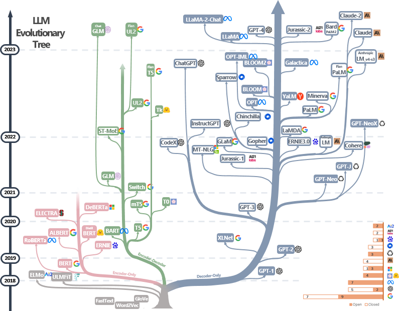

# The Practical Guides for Large Language Models

A curated (still actively updated) list of practical guide resources of LLMs. These sources aim to help practitioners navigate the vast landscape of large language models (LLMs) and their applications in natural language processing (NLP) applications. 

## Practical Guide for Models

We build an evolutionary tree of modern Large Language Models (LLMs) to trace the development of language models in recent years and highlights some of the most well-known models, in the following figure:

### BERT-style Language Models: Encoder-Decoder or Encoder-only

- ELMo
- BERT
- RoBERTa
- DistilBERT
- BioBERT
- XLM
- Xlnet
- ALBERT
- ELECTRA
- T5
- XLM-E
- ST-MoE
- AlexaTM

### GPT-style Language Models: Decoder-only

- GPT-3
- OPT
- PaLM
- BLOOM
- GLM
- MT-NLG
- GLaM
- Gopher
- chinchilla
- LaMDA
- GPT-J
- LLaMA
- GPT-4
- BloombergGPT

## Practical Guide for Data

### Pretraining data
### Finetuning data
### Test data/user data

## Practical Guide for NLP Tasks
We build a decision flow for choosing LLMs or fine-tuned models~\protect\footnotemark for user's NLP applications. The decision flow helps users assess whether their downstream NLP applications at hand meet specific conditions and, based on that evaluation, determine whether LLMs or fine-tuned models are the most suitable choice for their applications.

### Traditional NLU tasks
1. No use case
2. Use case

### Traditional NLG tasks
1. Use case
2. No use case

### Knowledge-intensive tasks
1. Use case
2. No use case

### Abilities with Scaling
1. Use Case with Reasoning
2. Use Cases with Emergent Abilities
3. No-Use Cases and Understanding

### Specific tasks
1. No use case
2. Use case

### Real-World Tasks

### Efficiency
1. Cost
2. Latency
3. Parameter-Efficient Fine-Tuning

### Trustworthiness
1. Robustness and Calibration
2. Fairness and Bias
3. Spurious biases
